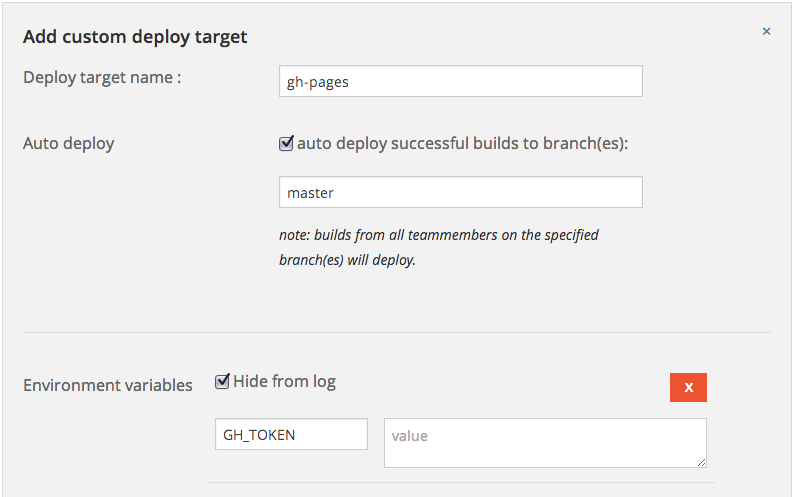
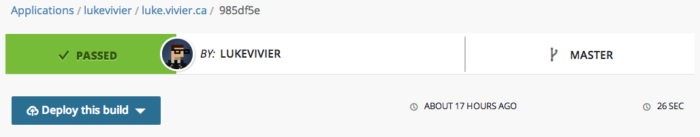

GitHub Pages is ideal for hosting project sites and personal blogs. In terms of publishing tools, support is limited to Jekyll, or plain static HTML. If Jekyll doesn’t cut it for you, then you gotta do it *custom*. Enter wercker.

[Wercker](http://wercker.com/) is a hosted continuous integration and deployment platform that allows you to set up custom test and deploy pipelines for all your projects. It integrates with GitHub, and supports ruby, python, and node apps with minimal configuration.

For my site at [luke.vivier.ca](http://luke.vivier.ca/), I've decided to use [wintersmith](http://wintersmith.io/) as my publishing tool. Wintersmith is a super-powered static site generator with an amazingly adaptable plugin system, great docs, and a budding community. It's a node app, and uses jade and markdown out of the box. 

Using my wintersmith site as a template, we'll walk through the steps to set up wercker to deploy a freshly-built version of your static site every time you push to GitHub.

## Sign up for wercker

Signing up for wercker is dead easy. Just go to [wercker.com](http://wercker.com/) and register. Once you've signed up, add your site as an application on wercker. From the home page, click *Add an application* and follow the prompts. You'll have to sign in to GitHub, choose your site's GitHub repo, and add "werckerbot" as a collaborator.

## Building

Wercker's build configuration is easily customizable. I'll detail the wintersmith build command below, but any other static site builder like hyde, Middleman, or nanoc is usable, as long as it outputs static HTML.

Before you proceed, make sure you have wintersmith and any plugins added to your `package.json`.

To configure itself, wercker looks for a file called `wercker.yml` in the root of your repo. Add one with these contents:

```yaml
box: wercker/nodejs
build:
  steps:
    - npm-install
    - script:
        name: wintersmith build
        code: ./node_modules/.bin/wintersmith build -o ./build
```

When wercker builds your site, it will clone your GitHub repo to a virtual machine (the `box: wercker/nodejs` part), then run each build step in order. The first step runs `$ npm install` on the project. The second step executes the wintersmith build command and places the output in the "build" directory.

## Set up deployment

Before we set up a deploy target, we need a Personal API Access Token. Go to the [Applications page](https://github.com/settings/applications) in your account settings on GitHub. Click on *Create new token*, and copy the token that appears.

<figure>
  
  <figcaption>
    Access token dialog on GitHub.
  </figcaption>
</figure>

Now create a deploy target on wercker. Go to the Settings tab for your application, click *Add deploy target*, and choose *custom deploy*. Give it a name, and enable *auto deploy successful builds to branches* (add "master"). Add an environment variable and paste the access token from GitHub as the value.

<figure>
  
  <figcaption>
    Add deploy target dialog on wercker.
  </figcaption>
</figure>

Now we'll add a deploy step to `wercker.yml`:

```yaml
deploy:
  steps:
    - lukevivier/gh-pages:
        token: $GH_TOKEN
        basedir: build
        domain: luke.vivier.ca
```

We're using the `gh-pages` step that I wrote for the [wercker directory](http://devcenter.wercker.com/articles/directory/). It automates some of the tedious parts of publishing to GitHub Pages. Use the environment variable we added to the deploy target as the value of `token`. This is so we don't store your top secret access token in a public place. Set `basedir` to "build", the directory we told wintersmith to store output in.

### Custom domains

Add a `domain` option to the deploy step if you want a [custom domain](https://help.github.com/articles/setting-up-a-custom-domain-with-pages) file to be created for you automatically.

## Deploy!

Commit `wercker.yml` and push it up to GitHub. On wercker, the Builds tab for your application should show the build in process. If you enabled auto deploy on the deploy target, it will start as soon as the build passes. Otherwise, click on the build and select your target from *Deploy this build* dropdown. After a few moments, your wintersmith site is deployed to the `gh-pages` branch on GitHub.

<figure>
  
  <figcaption>
    Manually deploying a build on wercker.
  </figcaption>
</figure>

Voila! Now you can use any static site builder with your project sites and have them deployed automatically when you push to GitHub.
